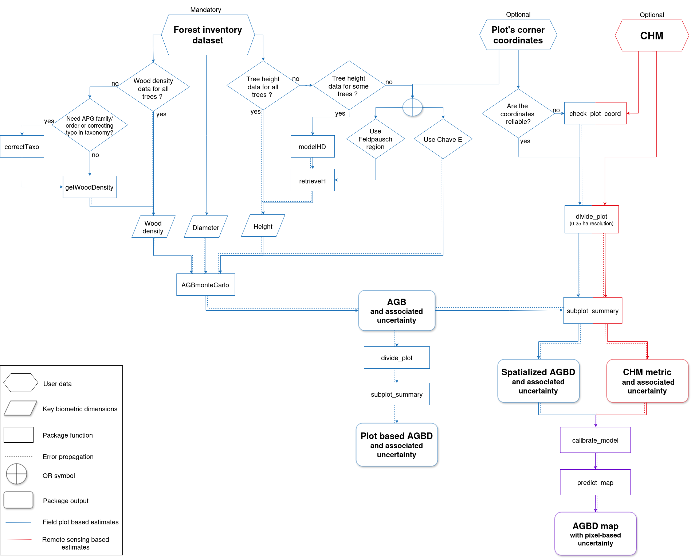
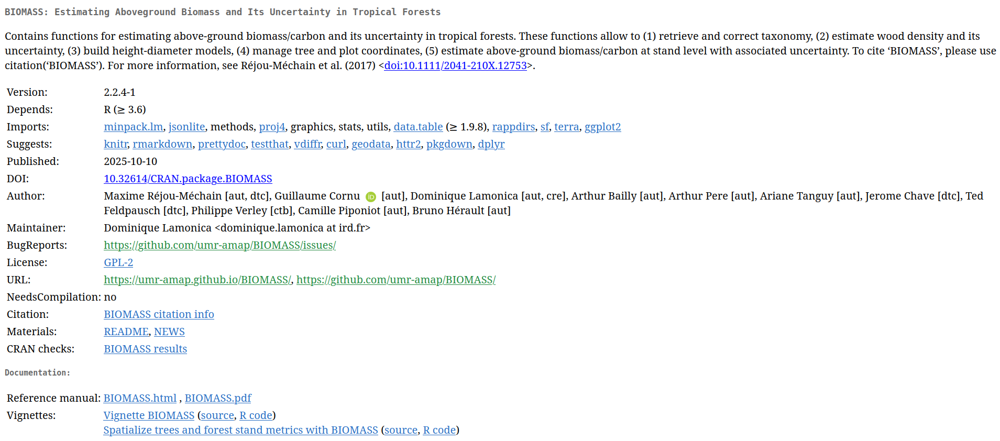
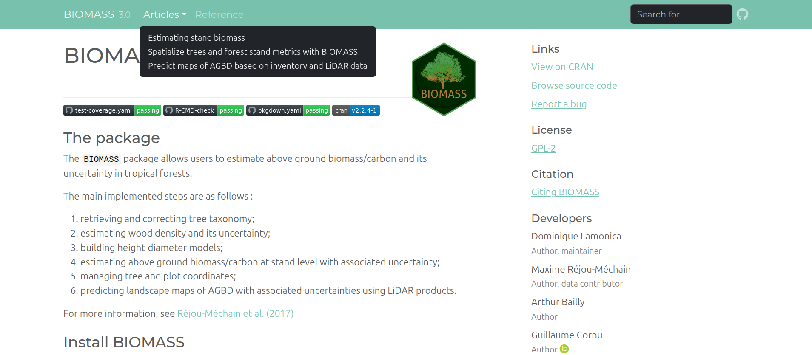

# Brief introduction

## 
{height=100%}

## CRAN R package \hspace{1mm} \includegraphics[width=1.3cm]{img/R_logo.svg.png}

{height=100%}
\newline

- Many contributors - some on specific features, others on the entire package

## GitHub public repository

{height=100%}
\newline

- Entire code accessible, issues open
- Developing version
- CI

## Vignettes

{height=100%}
\newline

- Tutorial for the entire pipeline divided in three main articles, applied on reduced Nouragues data

## Shiny app - BIOMASSapp \hspace{1mm} \includegraphics[width=1.3cm]{img/logo_shiny.jpeg}

{height=100%}
\newline

- Estimate AGBD per subplot with uncertainties
- Spatialize stand metrics
- No map prediction

## 
{height=100%}

# BIOMASSapp demonstration

# Predict AGBD maps using inventory and LiDAR data

## CHM-AGBD model calibration: proposed statistical framework

- geostatistical model with SPV-I/C (SPatially Varying Intercept/Coefficients) to integrate spatial correlation:

- $y(s) = (\alpha + \tilde{\alpha}(s)) + (\beta + \tilde{\beta}(s)) \times x(s) + \epsilon(s)$
\newline
with $\tilde{\alpha}(s_1),...,\tilde{\alpha}(s_n) \sim MVN(0,C_{\alpha}(s_i,s_j))$

- references
{width=50%}{width=50%}

## Implementation in BIOMASS

- inference and predictions done using brms R package {height=15%} 

- two functions: 1st calibrates the model with user plot and LiDAR data, 2nd predicts AGBD and its associated uncertainties over the full raster footprint provided by the user

- full continuity of the pipeline: the inputs of those functions are the outputs from the previous steps

- propagate all AGBD uncertainties from the previous steps, within Bayesian framework

## CHM-AGBD model calibration: Nouragues data example

:::: {.columns}

::: {.column width="30%"}
{height=80%} 

:::

::: {.column width="70%"}

SPV-C model \newline
$log(y(s)) = (\beta + \tilde{\beta}(s)) \times log(x(s)) + \epsilon(s)$
\newline
with

- $y(s)$ AGBD 0.25ha for plot $s$ : ajouter plot de l'agbd carré divisé + incertitudes

- $x(s)$ mean (or median) CHM 0.25ha for plot $s$ : ajouter plot du raster + carré divisé

- $\tilde{\beta}(s_1),...,\tilde{\beta}(s_n) \sim MVN(0,C_{\beta}(s_i,s_j))$

:::

::::

## CHM-AGBD model calibration: Nouragues data example

ici screen du model_fit + plot ppc

## Map prediction: Nouragues data example
{height=58%}
ici nouveau plot avec mean, sd, coeff var (à faire)

## Validation

In the vignette we propose to calibrate on 70% of data, then validate on 30%, screen de la vignette

# Future work, this week and later on (à traduire)

- Temporal BIOMASS

- Quality check plus robuste avec du simple ou multidates

- Nouvelle allométrie générique globale de l'AGB

- Implementation d'une (ou de) nouvelle(s) approche(s) d'estimation de hauteur en absence de données terrain

- Travail sur le modèle AGBD - LiDAR déjà développé dans BIOMASS V3.0 (flexibilité)

- Prise en compte l'incertitude de positionnement sur individual trees

- Gestion de l'API WFO pour la correction taxonomique 

- Gestion de plots circulaires dans le pipeline de spatialisation des estimations

- Travail de recherche autour de la mise en place d'une nouvelle stratégie de modélisation AGB & LiDAR

