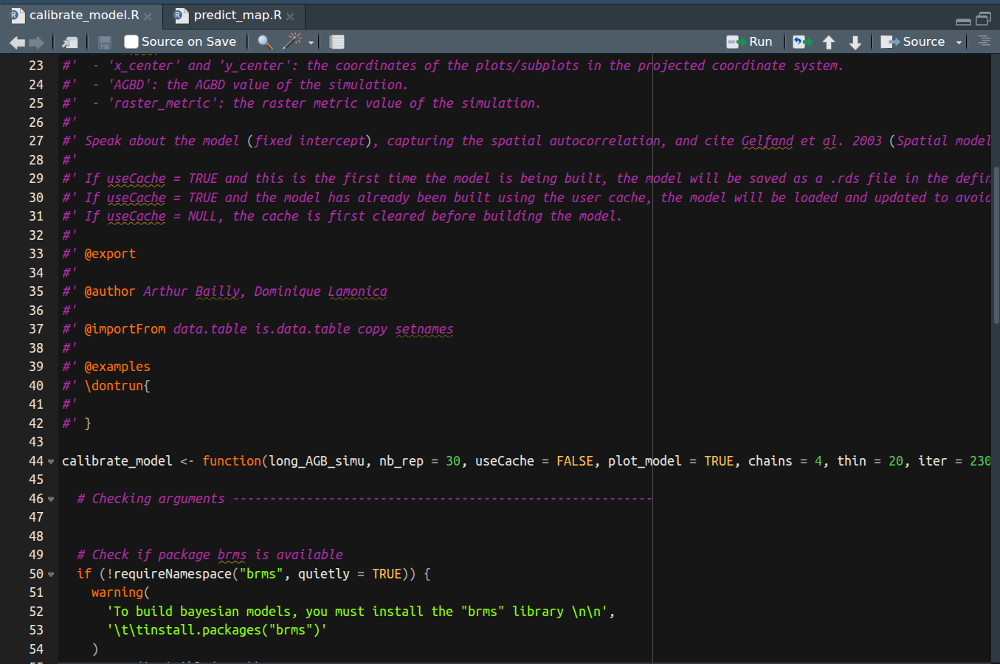

## BIOMASS R package FRM4BIOMASS

{height=100%}

## \textcolor{violet}{CHM-AGBD model calibration (V3)}

{height=100%}

## CHM-AGBD model calibration: proposed statistical framework

- geostatistical model with SPV-I/C (SPatially Varying Intercept/Coefficients) to integrate spatial correlation:

- $y(s) = (\alpha + \tilde{\alpha}(s)) + (\beta + \tilde{\beta}(s)) \times x(s) + \epsilon(s)$
\newline
with $\tilde{\alpha}(s_1),...,\tilde{\alpha}(s_n) \sim MVN(0,C_{\alpha}(s_i,s_j))$

- references
{width=50%}{width=50%}

## CHM-AGBD model calibration: proposed statistical framework

$y(s) = (\alpha + \tilde{\alpha}(s)) + (\beta + \tilde{\beta}(s)) \times x(s) + \epsilon(s)$
\newline
with $\tilde{\alpha}(s_1),...,\tilde{\alpha}(s_n) \sim MVN(0,C_{\alpha}(s_i,s_j))$

{width=30%}{width=30%}
{width=30%}

## CHM-AGBD model calibration: proposed statistical framework

- SPDE procedure

- semi-automated workflow in a github repository

- INLA based no R package on CRAN

$\rightarrow$ need for our own workflow

## Implementation challenges

- taking into account AGBD uncertainties

- computation time

- packages on CRAN

$\rightarrow$ we chose brms R package \hspace{2em} {height=15%} 

## CHM-AGBD model calibration: example with simulated data

:::: {.columns}

::: {.column width="30%"}
{height=80%} 
:::

::: {.column width="70%"}

- SpVC model \newline
$log(AGBD(s)) = \alpha  + (\beta + \tilde{\beta}(s)) \times log(CHM(s)) + \epsilon(s)$
\newline
with $\tilde{\beta}(s_1),...,\tilde{\beta}(s_n) \sim MVN(0,C_{\beta}(s_i,s_j))$ and $\alpha = 0$

\vspace{0.5cm}

- Simulated data

{height=60%}

:::

::::

## CHM-AGBD model estimates brms

{height=100%}

## CHM-AGBD covariance functions

{height=100%}

## CHM-AGBD posterior predictive checks

{height=100%}

## CHM-AGBD model calibration: example with Nouragues data

:::: {.columns}

::: {.column width="30%"}
{height=80%} 

:::

::: {.column width="70%"}

- SPV-C model \newline
$log(AGBD(s)) = (\beta + \tilde{\beta}(s)) \times log(CHM(s)) + \epsilon(s)$
\newline
with $\tilde{\beta}(s_1),...,\tilde{\beta}(s_n) \sim MVN(0,C_{\beta}(s_i,s_j))$

:::

::::

## Predictions on Nouragues (brms)
{height=58%}

## Predictions on Nouragues: coefficient of variation (brms)
{height=58%}

## Two functions in the package
{height=100%}

## CHM-AGBD model calibration: implementation possibilities

- propagation of AGBD estimates uncertainties

- SPDE procedure

- future statistical development to use all the CHM spatial structure: better use of available information for a more robust & precise full spatial AGBD prediction (for a next major version)
