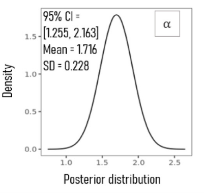
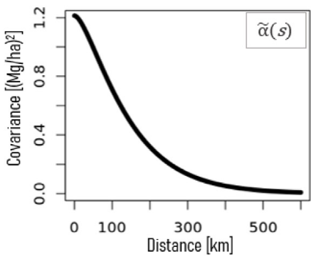
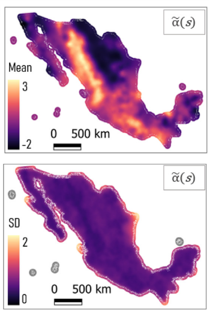
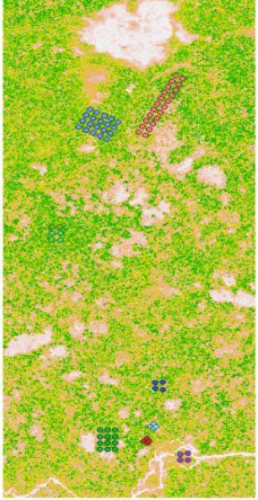
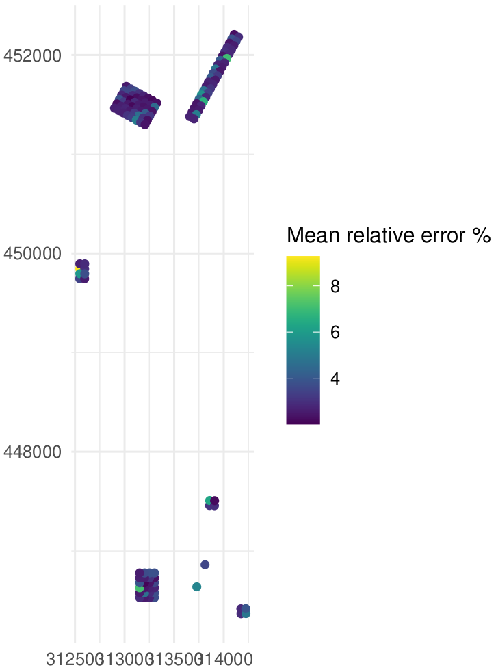
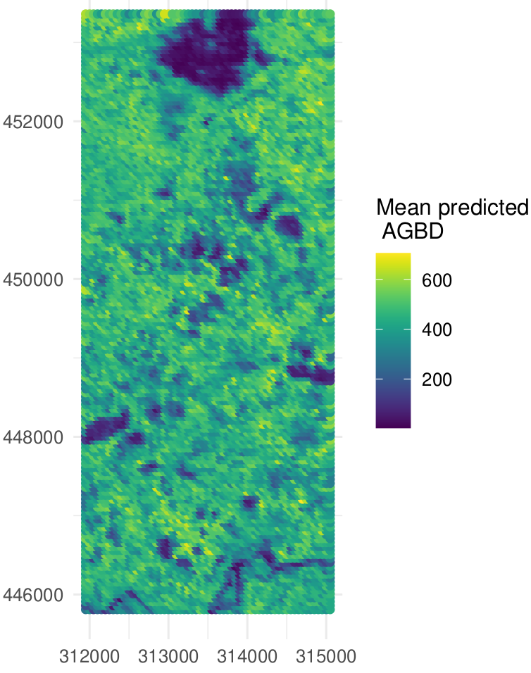
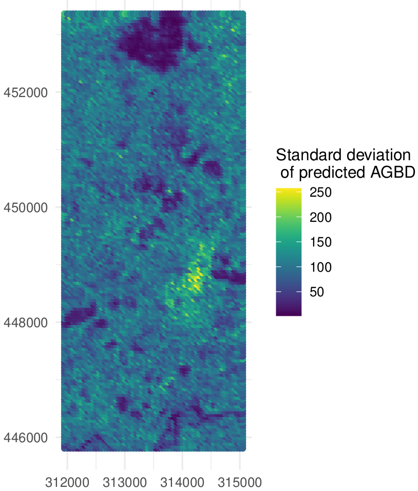
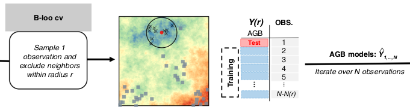

## BIOMASS R package FRM4BIOMASS

{height=100%}

# FRM4BIOMASS: what has been done

## Propagation of uncertainties in the H-D model

Since the version 2.2.6:

:::: {.columns}

::: {.column width="50%"}

{height=100%}

:::

::: {.column width="50%"}

{height=100%}

:::

::::

## Propagation of uncertainties in spatialized metrics

Since version 2.2.7:

:::: {.columns}

::: {.column width="50%"}

{height=100%}

:::

::: {.column width="50%"}

{height=100%}

:::

::::

## Shiny app for BIOMASS

\small The BIOMASS app now enables users to obtain spatialised estimates of AGBD and LiDAR metrics, as well as any other tree metrics. 

{height=100%}

## Shiny app for BIOMASS

{height=100%}

\tiny Propagation of plot corner uncertainties is not allowed in BIOMASSapp. 

# FRM4BIOMASS: ongoing work

## updating taxonomy correction

Contribution by John Goodlee using the World Flora API.

{width=100%}

\small Good work, but still some issues to preserve backward compatibility

## updating the Global Wood Density Database v.2

{width=100%}

\small Based on the GWDD v.2, Fabian used bayesian hierarchical models to provide wood density estimates and the associated uncertainties at the species- genus- and family-level. 

{width=100%}

\small Code in review, will be implemented in BIOMASS very soon.

## \textcolor{violet}{CHM-AGBD model calibration (V3)}

{height=100%}

## CHM-AGBD model calibration: proposed statistical framework

- geostatistical model with SPV-I/C (SPatially Varying Intercept/Coefficients) to integrate spatial correlation:

- $y(s) = (\alpha + \tilde{\alpha}(s)) + (\beta + \tilde{\beta}(s)) \times x(s) + \epsilon(s)$
\newline
with $\tilde{\alpha}(s_1),...,\tilde{\alpha}(s_n) \sim MVN(0,C_{\alpha}(s_i,s_j))$

- references
{width=50%}{width=50%}

## CHM-AGBD model calibration: proposed statistical framework

$y(s) = (\alpha + \tilde{\alpha}(s)) + (\beta + \tilde{\beta}(s)) \times x(s) + \epsilon(s)$
\newline
with $\tilde{\alpha}(s_1),...,\tilde{\alpha}(s_n) \sim MVN(0,C_{\alpha}(s_i,s_j))$

{width=30%}{width=30%}
{width=30%}

## CHM-AGBD model calibration: example with Nouragues data

:::: {.columns}

::: {.column width="30%"}
{height=80%} 

:::

::: {.column width="70%"}

- SPV-I model \newline
$log(AGBD(s)) = (\alpha + \tilde{\alpha}(s)) + \beta \times log(CHM(s)) + \epsilon(s)$
\newline
with $\tilde{\alpha}(s_1),...,\tilde{\alpha}(s_n) \sim MVN(0,C_{\alpha}(s_i,s_j))$

:::

::::

## CHM-AGBD model estimates and plot prediction (1/2)

{height=100%}

## CHM-AGBD model estimates and plot prediction (2/2)

{height=100%}

## CHM-AGBD model errors: plots

:::: {.columns}

::: {.column width="25%"}
{height=100%}

:::

::: {.column width="75%"}

{height=100%}

:::

::::

## CHM-AGBD model landscape predictions (1/2)

{height=100%}

## CHM-AGBD model landscape predictions (2/2)

{height=75%}{height=75%}

## CHM-AGBD model calibration: implementation possibilities & difficulties

- brms package, STAN, geostat module in JAGS

- how to propagate AGBD estimates uncertainties, computation wise (eg Monte Carlo procedure, or directly into the model ?)

- pixel error propagation: Monte Carlo procedure

- future statistical development to use all the CHM spatial structure: better use of available information for a more robust & precise full spatial AGBD prediction (for a next major version)

## CHM-AGBD model validation

- initially, proposed framework: spatial Leave-One-Out, Ploton et al. 2020 Nature Com.

{height=100%}

- but computationally super intensive, so external validation (using independent dataset or splitting dataset) to be considered

- needs further discussion!

## Final product: uncertainty sources & how to deal with them
\small
$U_{ref}= U_{Inst} + U_{Model} + U_{Location} + U_{Area} + U_{Representativeness}$
\vspace{0.3cm}

- wood density, height, diameter $U_{Inst}$

- plot based AGB prediction: allometric relationship with Monte Carlo procedure $U_{Model}$

- plot based AGBD-CHM calibration: spatial structure with SPVI/C (Bayesian framework) $U_{Model}$

- full spatial AGBD prediction: plot based AGBD uncertainties with Monte Carlo procedure ? $U_{Model}$

- plot based AGB density & CHM computation: pixel error with Monte Carlo procedure $U_{Location}$ & $U_{Area}$

# Perspectives

## Short term perspectives - with Arthur

- new allometric relationship to predict AGB

- companion paper for V3 BIOMASS R package

- waiting for wood density database update

- update taxonomy correction, currently we do not deal with synonymy $\rightarrow$ waiting for Renato's package to be on CRAN

- error detection: outliers (diameter, height, wood density)

## Long term perspectives - with ?

Temporal BIOMASS

- propagating joint errors on differentes dates, for plots and LiDAR

- technically challenging: package implementation and structure to integrate temporal dynamics

- approaches for allometric relationships and differences in AGBD, CHM ?

# Thank you for your attention

