## BIOMASS R package FRM4BIOMASS

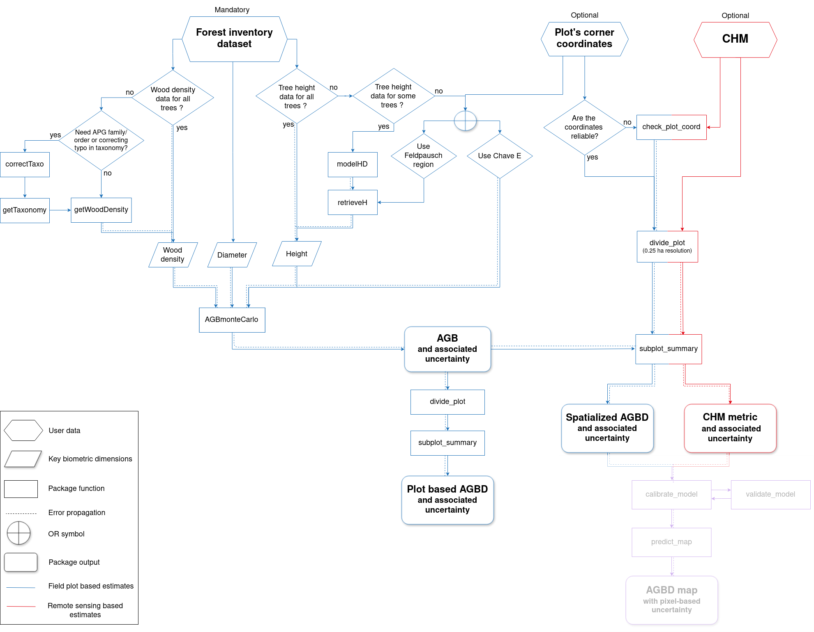{height=100%}

# FRM4BIOMASS: what has been done

## Propagation of uncertainties in the H-D model

Since the version 2.2.6:

:::: {.columns}

::: {.column width="50%"}

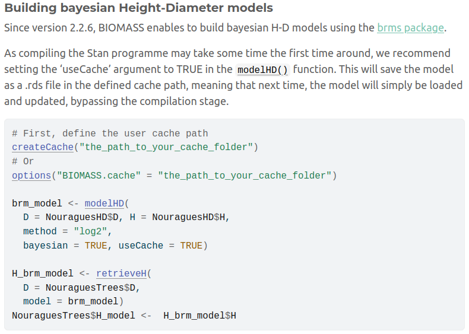{height=100%}

:::

::: {.column width="50%"}

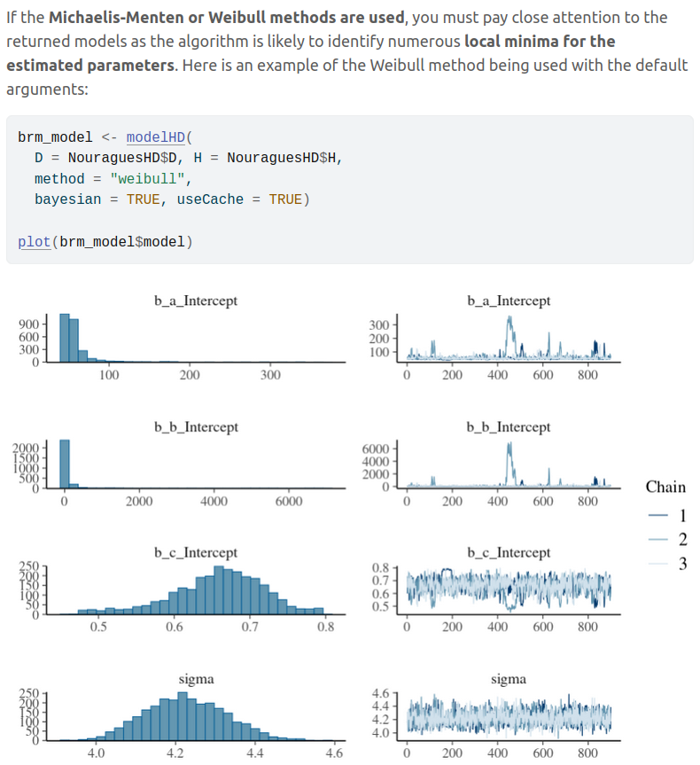{height=100%}

:::

::::

## Propagation of uncertainties in spatialized metrics

Since version 2.2.7:

:::: {.columns}

::: {.column width="50%"}

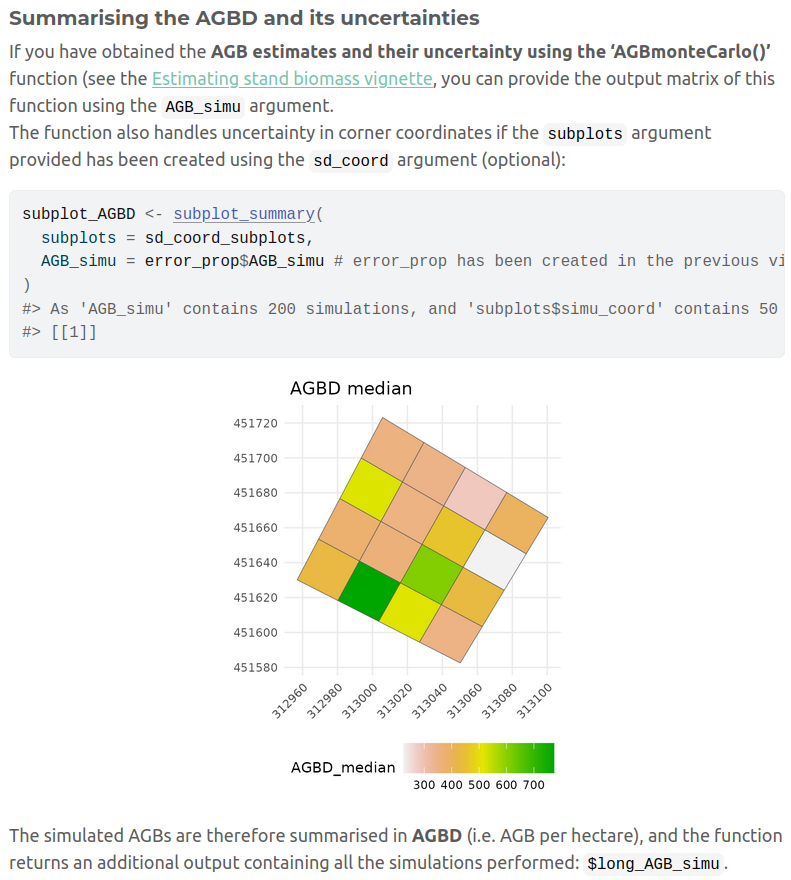{height=100%}

:::

::: {.column width="50%"}

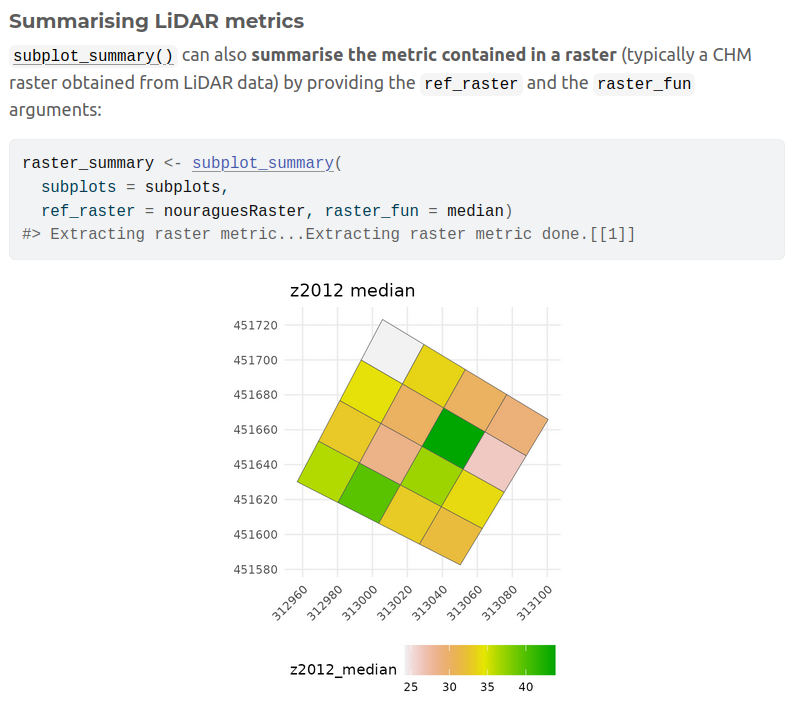{height=100%}

:::

::::

## Shiny app for BIOMASS

\small The BIOMASS app now enables users to obtain spatialised estimates of AGBD and LiDAR metrics, as well as any other tree metrics. 

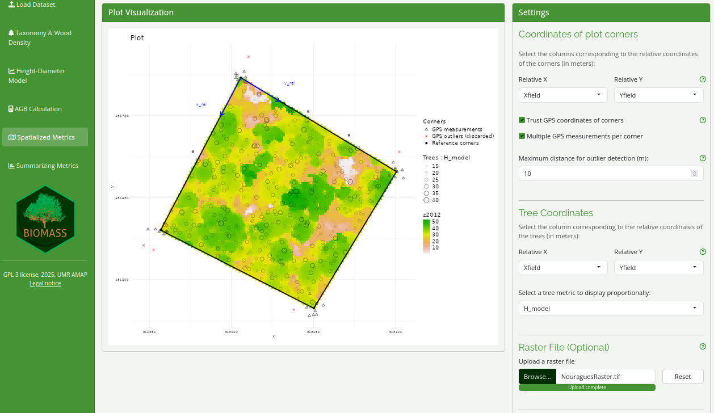{height=100%}

## Shiny app for BIOMASS

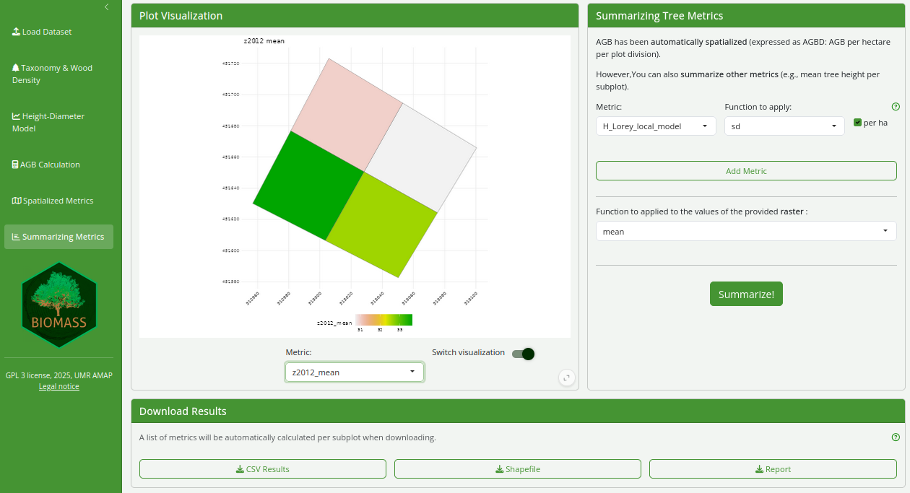{height=100%}

\tiny Propagation of plot corner uncertainties is not allowed in BIOMASSapp. 

# FRM4BIOMASS: ongoing work

## updating taxonomy correction

Contribution by John Goodlee using the World Flora API.

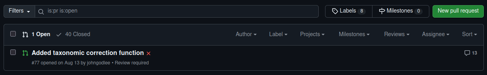{width=100%}

\small Good work, but still some issues to preserve backward compatibility

## updating the Global Wood Density Database v.2

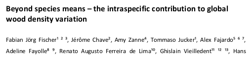{width=100%}

\small Based on the GWDD v.2, Fabian used bayesian hierarchical models to provide wood density estimates and the associated uncertainties at the species- genus- and family-level. 

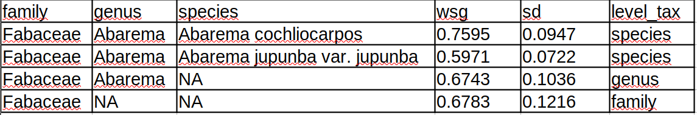{width=100%}

\small Code in review, will be implemented in BIOMASS as soon as the paper is accepted.

## \textcolor{violet}{CHM-AGBD model calibration (V3)}

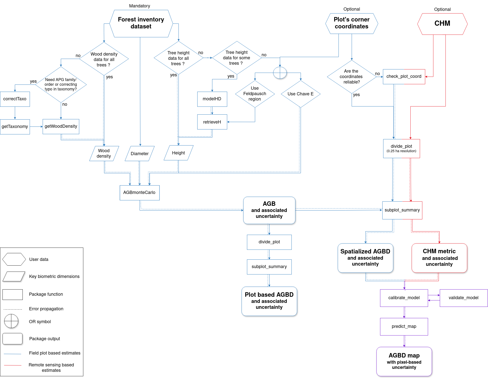{height=100%}

## CHM-AGBD model calibration: proposed statistical framework

- geostatistical model with SPV-I/C (SPatially Varying Intercept/Coefficients) to integrate spatial correlation:

- $y(s) = (\alpha + \tilde{\alpha}(s)) + (\beta + \tilde{\beta}(s)) \times x(s) + \epsilon(s)$
\newline
with $\tilde{\alpha}(s_1),...,\tilde{\alpha}(s_n) \sim MVN(0,C_{\alpha}(s_i,s_j))$

- references
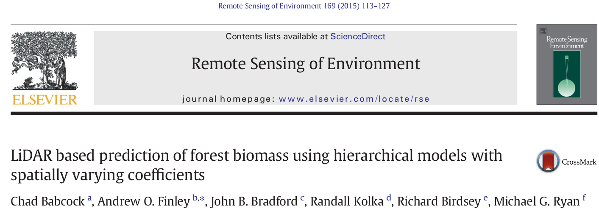{width=50%}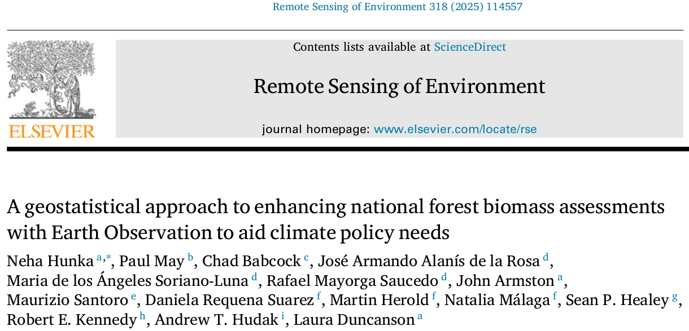{width=50%}

## CHM-AGBD model calibration: proposed statistical framework

- SPDE procedure

- semi-automated workflow in a github repository

- INLA based no R package on CRAN

$\rightarrow$ need for our own workflow

## Implementation challenges

- taking into account AGBD uncertainties

- computation time

- packages on CRAN

$\rightarrow$ Two candidate packages: brms & sdmTMB

## Available packages

:::: {.columns}

::: {.column width="50%"}
brms

- almost no hyperparameters to tune

- direct integration of AGBD replicates

- time-consuming

:::

::: {.column width="50%"}

sdmTMB

- SPDE procedure with a mesh

- very quick (almost instantaneous)

- informative a priori to include AGBD uncertainty

:::

::::

## CHM-AGBD model calibration: example with simulated data

:::: {.columns}

::: {.column width="30%"}
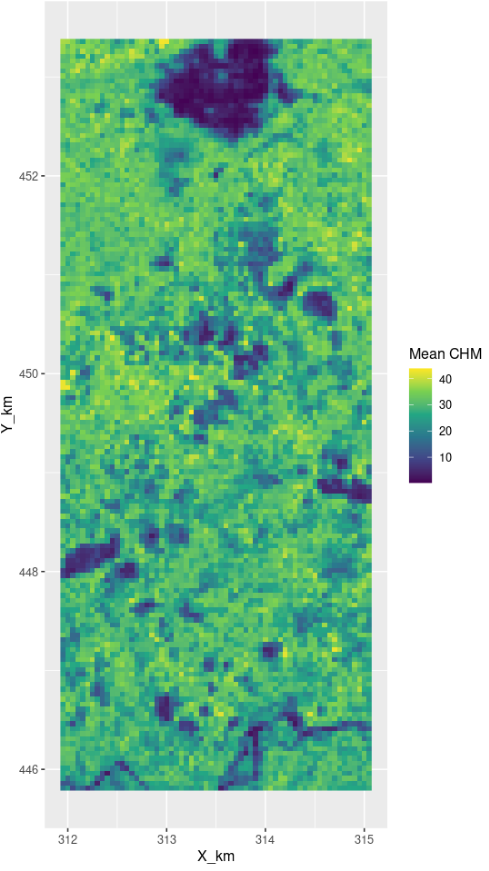{height=80%} 
:::

::: {.column width="70%"}

- SpVC model \newline
$log(AGBD(s)) = \alpha  + (\beta + \tilde{\beta}(s)) \times log(CHM(s)) + \epsilon(s)$
\newline
with $\tilde{\beta}(s_1),...,\tilde{\beta}(s_n) \sim MVN(0,C_{\beta}(s_i,s_j))$ and $\alpha = 0$

\vspace{0.5cm}

- Simulated data

{height=60%}

:::

::::

## CHM-AGBD model estimates sdmTMB

{height=100%}

## CHM-AGBD model estimates brms

{height=100%}

## CHM-AGBD covariance functions

{height=58%}
{height=58%}

## CHM-AGBD posterior predictive checks

{height=58%}
{height=58%}

## Predictions on Nouragues (sdmTMB)
{height=58%}

## Predictions on Nouragues (brms)
{height=58%}

## Predictions on Nouragues: coefficient of variation (brms)
{height=58%}

## CHM-AGBD model calibration: implementation possibilities

- propagation of AGBD estimates uncertainties

- future statistical development to use all the CHM spatial structure: better use of available information for a more robust & precise full spatial AGBD prediction (for a next major version)

# Perspectives

## Perspectives for package development

- SSM development

- new allometric relationship to predict AGB

- error detection: outliers (diameter, height, wood density)

## Long term perspectives

Temporal BIOMASS

- propagating joint errors on differentes dates, for plots and LiDAR

- technically challenging: package implementation and structure to integrate temporal dynamics

- approaches for allometric relationships and differences in AGBD, CHM ?

