# Brief introduction

## For what ?

**Estimate Aboveground Biomass and Its Uncertainty in Tropical Forests**

$\rightarrow$ contains functions for estimating above-ground biomass/carbon and its uncertainty in tropical forests. These functions allow to:

1. retrieve and correct taxonomy,
2. estimate wood density and its uncertainty,
3. build height-diameter models,
4. manage tree and plot coordinates,
5. estimate above-ground biomass/carbon at stand level with associated uncertainty.

## CRAN R package \hspace{1mm} \includegraphics[width=1.3cm]{img/R_logo.svg.png}

**Current CRAN version: 2.2.7**  \newline 
\vspace{-0.2cm}
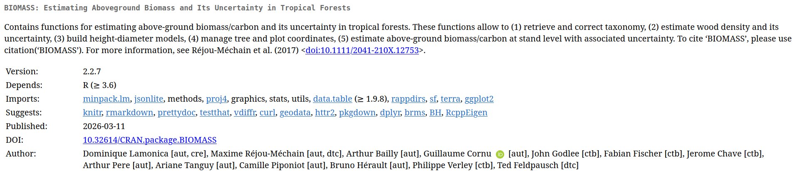{height=100%}
\newline

:::: {.columns}
::: {.column width="50%"}
**Archives** \newline
\vspace{-0.2cm}
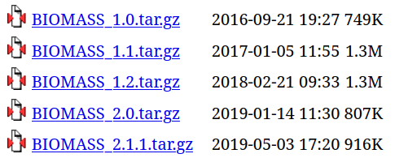{height=30%} 
:::
::: {.column width="50%"}
\vspace{1.1cm}
Almost 10 years of existence!
:::
::::

## GitHub public repository

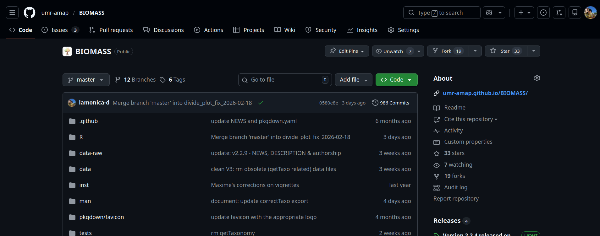{height=100%}
\newline

- Entire code accessible, issues open
- Developing version: 3.0
- CI

## Vignettes

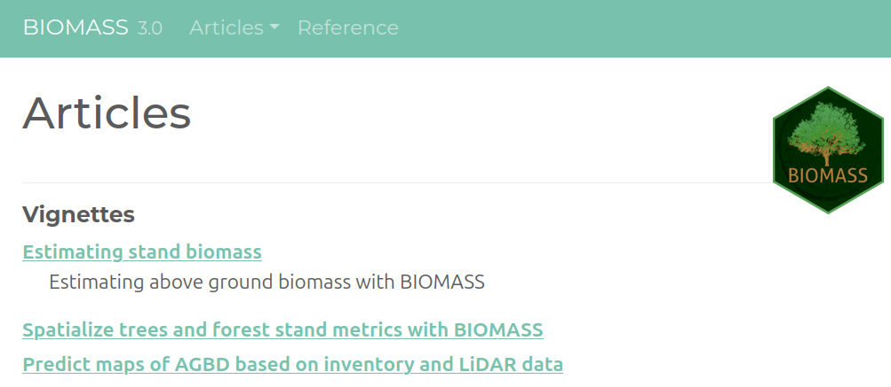{height=100%}
\newline

- Tutorial for the entire pipeline divided in three main articles, applied on reduced Nouragues data

## Shiny app - BIOMASSapp \hspace{1mm} \includegraphics[width=1.3cm]{img/logo_shiny.jpeg}

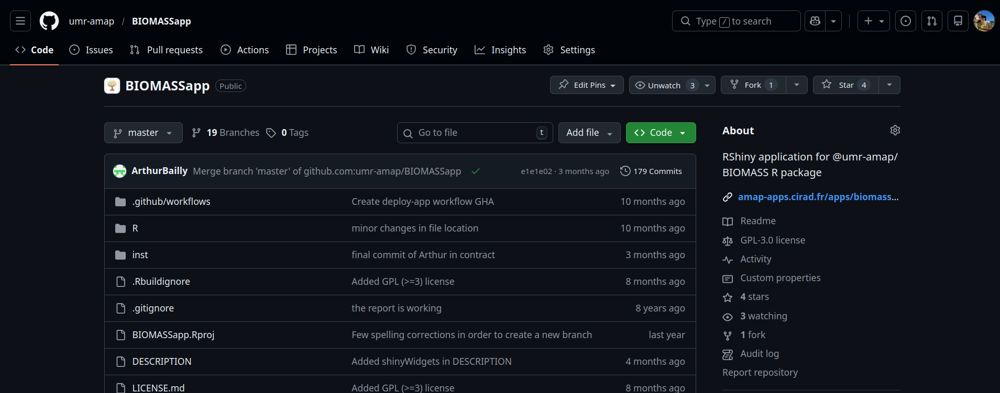{height=100%}
\newline

- Estimate AGBD per subplot with uncertainties
- Spatialize stand metrics
- No map prediction: target users, output evaluation, technical limitations

## 
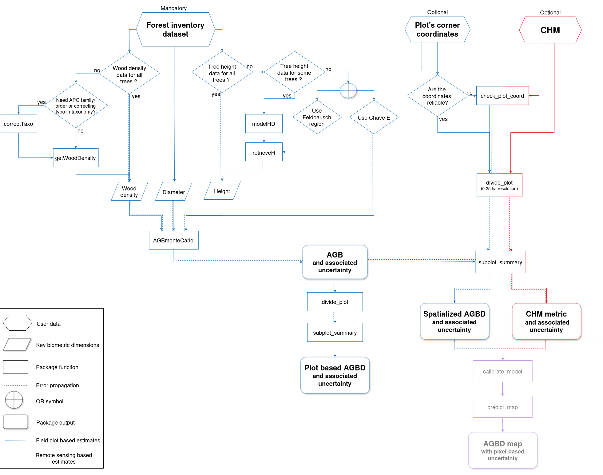{height=100%}

# BIOMASSapp demonstration

# Predict AGBD maps using inventory and LiDAR data

## AGBD-LiDAR modelisation: proposed statistical framework

- geostatistical model with SPV-I/C (SPatially Varying Intercept/Coefficients) to integrate spatial correlation:

- $y(s) = (\alpha + \tilde{\alpha}(s)) + (\beta + \tilde{\beta}(s)) \times x(s) + \epsilon(s)$
\newline
with $\tilde{\alpha}(s_1),...,\tilde{\alpha}(s_n) \sim MVN(0,C_{\alpha}(s_i,s_j))$

- references
{width=50%}{width=50%}

## Implementation in BIOMASS

- inference and predictions done using brms R package 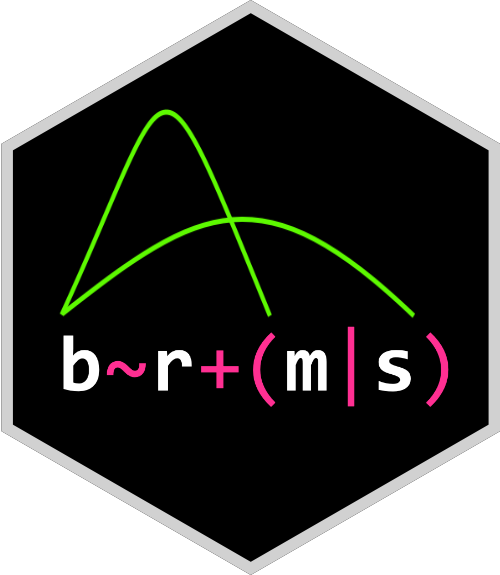{height=15%} 

- two functions: 1st calibrates the model with user plot and LiDAR data, 2nd predicts AGBD and its associated uncertainties over the full raster footprint provided by the user

- full continuity of the pipeline: the inputs of those functions are the outputs from the previous steps

- propagate all AGBD uncertainties from the previous steps, within Bayesian framework

## Example - Nouragues: input data
 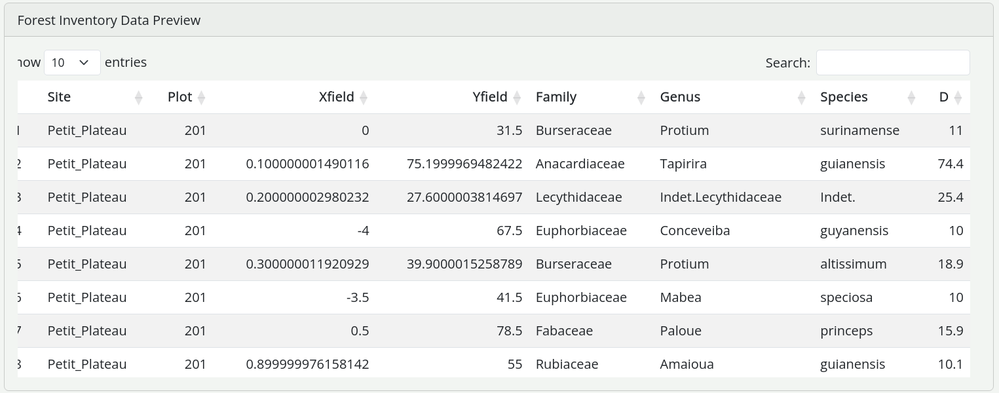{height=35%}\hspace{0.2cm}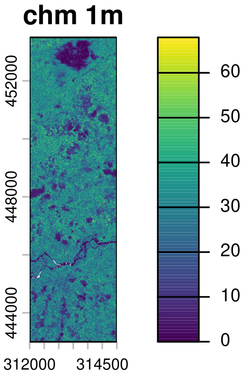{height=40%} \newline

- Tree inventory & (including coordinates)
- LiDAR metric landscape level (e.g. CHM)

$\rightarrow$ BIOMASS pipeline...

##

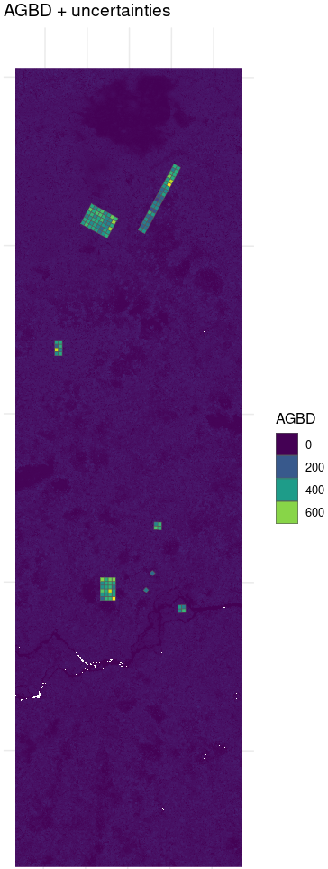{height=70%} 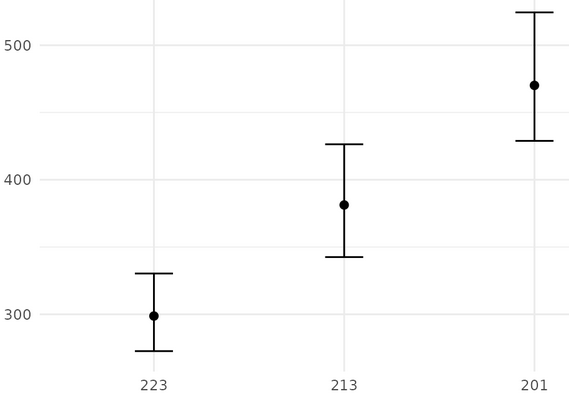{height=30%}\hspace{0.5cm} $\sim$ \hspace{0.5cm} 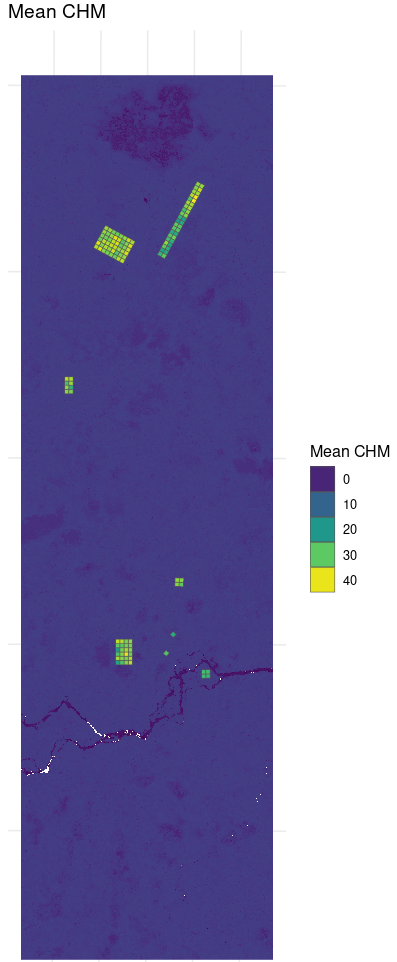{height=70%} \newline

- $y$ AGBD 0.25ha for each (sub)plot with uncertainties (log) 
- $x$ mean CHM 0.25ha for each (sub)plot (log)
- distances between plots

## CHM-AGBD model calibration

The function returns a *brms.fit* object \newline

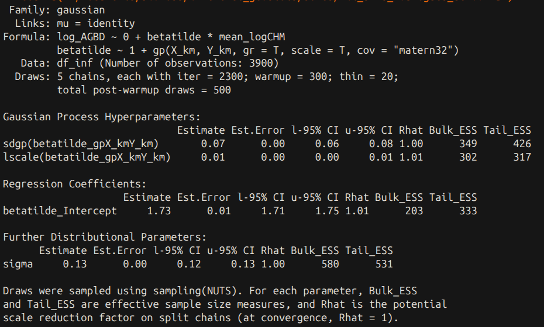{height=50%}\hspace{0.2cm}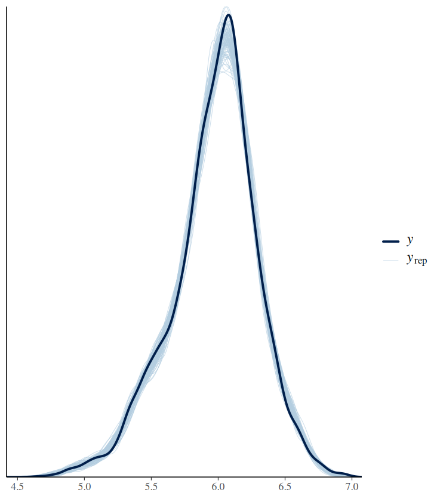{height=37%} \newline

$\rightarrow$ inference results to be checked

## Map predictions: arguments

:::: {.columns}

::: {.column width="30%"}
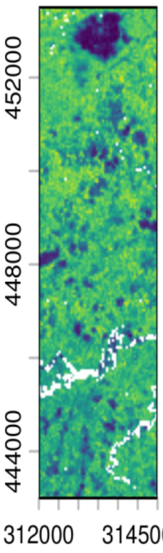{height=90%} 
:::

::: {.column width="70%"}

\vspace{2cm}

- LiDAR metrics at landscape level, resolution managed inside the function

- *brms.fit* object, output of calibration step

- optional: another raster for footprint
:::

::::

## Map predictions: output
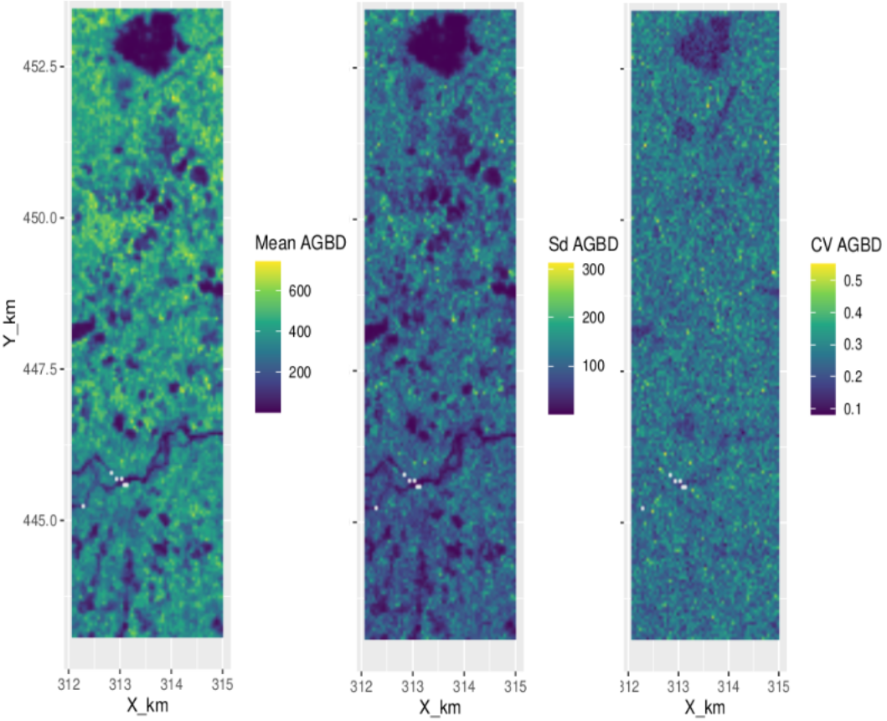{height=100%}

## Validation

:::: {.columns}

::: {.column width="50%"}
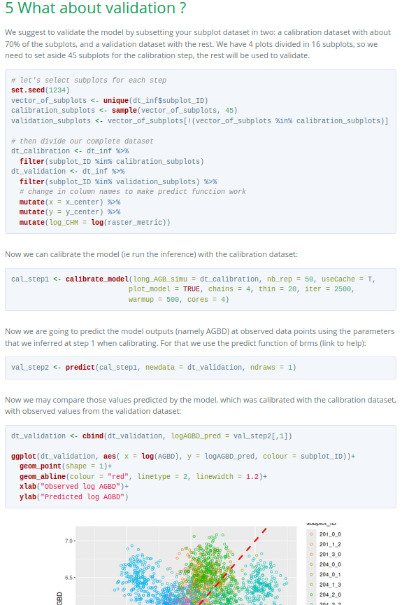{height=90%}
:::

::: {.column width="50%"}

\vspace{2cm}

- for now, no embedded validation procedure in the package

- in the vignette we propose a example of validation method

- to be discussed this week?
:::

::::

# Full code for BIOMASS pipeline

##

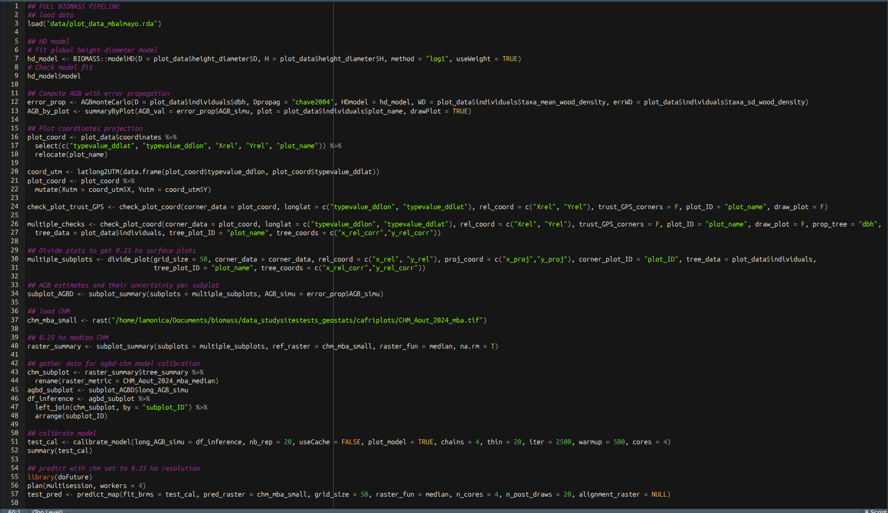{height=120%}

# Future work, this week and later on 

##

- More robust quality check with single or multiple dates

- New generic global allometry for AGB

- Implementation of one or more new approaches for estimating height in the absence of field data

- Taking into account positioning uncertainty on individual trees

- Management of circular plots in the spatialisation pipeline for estimates

- Flexibility of the AGBD-LiDAR model (implemented in v3.0)

- Temporal BIOMASS

## Authors and funders
\vspace{.1cm}
Maxime Réjou-Méchain, Dominique Lamonica, Arthur Bailly, Guillaume Cornu, John Godlee, Fabian Fischer, Jérome Chave, Arthur Pere, Ariane Tanguy, Camille Piponiot, Bruno Hérault, Philippe Verley, Ted Feldpausch
\vspace{.3cm}

{height=10%} European Spatial Agency \newline

{height=15%} Research Institute for Development \newline

{height=12%} the French agricultural research and cooperation organization working for the sustainable development of tropical and Mediterranean regions
